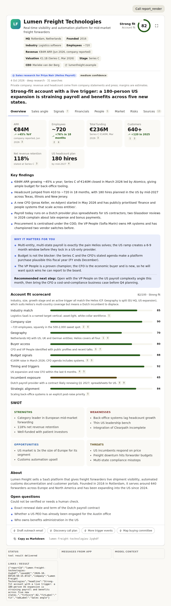
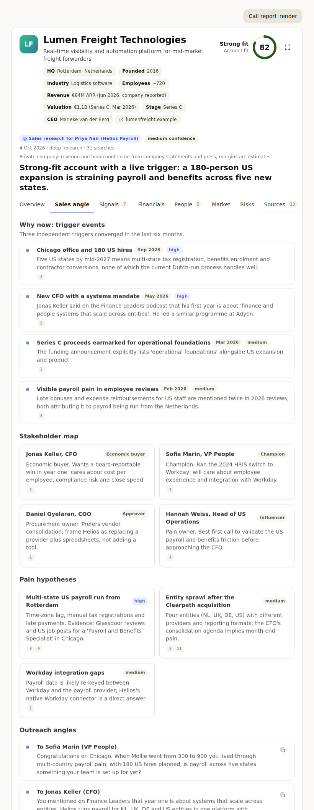
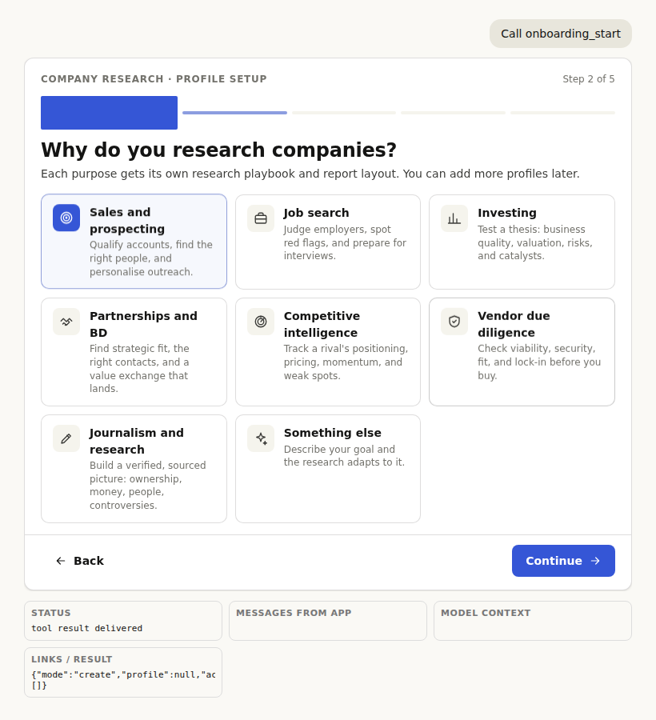

# Company Research MCP App

An [MCP App](https://modelcontextprotocol.io/extensions/apps) for Claude that turns "research this company" into a repeatable, purpose-aware workflow:

1. **Onboarding** (interactive form inside the chat): who you are and *why* you research companies: sales prospecting, job search, investing, partnerships, competitive intelligence, vendor due diligence, journalism, or something else. Purpose-specific questions follow (for sales, what you sell and who buys it; for investing, your thesis and metrics; and so on).
2. **Research playbook**: for each company, the server hands Claude a deep-research protocol tailored to your profile: goal, clarifying questions, focus areas, a search plan, a source checklist, verification rules, a depth budget (deep by default: 25-40+ searches), and the exact report sections to produce.
3. **Interactive report** (second MCP App): fit scorecard, metrics, signals timeline, financial charts, people, market, risks matrix, sentiment, purpose sections (for example stakeholder map and outreach angles for sales, interview prep for job search, bull/bear for investing), numbered sources with click-to-jump citations, one-click follow-ups that send prompts back to Claude, fullscreen mode, Markdown export. Light and dark themes follow Claude's style tokens.

| Report (overview) | Sales angle | Onboarding |
| --- | --- | --- |
|  |  |  |

More: [dark mode](docs/screenshots/e2e-report-overview-dark.png) · [fullscreen financials](docs/screenshots/e2e-report-fullscreen-financials-light.png) · [onboarding details step](docs/screenshots/e2e-onboarding-3-details.png) · [profile saved](docs/screenshots/e2e-onboarding-6-done.png)

The research itself is done by Claude with web search and page fetches. The server does not call any paid data API; it holds your profile, generates the protocol, stores reports, and serves the two views.

## Use it in Claude

MCP Apps render only for **remote connectors** (claude.ai and Claude Desktop). A locally configured server works as text-only. So the server needs a public HTTPS URL; the free tiers below are enough.

### 1. Deploy (free)

**Option A: Cloudflare Workers (recommended: free, always on, persistent storage via KV)**

[](https://deploy.workers.cloudflare.com/?url=https://github.com/vman-machine/company-research-mcp)

The button clones this repository into your account, provisions the `RESEARCH_KV` namespace declared in `wrangler.json`, builds the views and deploys. Or from a terminal:

```bash
npm install
npx wrangler login                 # opens the browser once
npx wrangler deploy                # builds the views, provisions KV, prints https://company-research-mcp.<you>.workers.dev
npx wrangler secret put ACCESS_KEY # optional but recommended, see Security
```

**Option B: Render (free web service)**

New Web Service → this repo → Build `npm ci && npm run build` → Start `npm start` → add env var `ACCESS_KEY`. Free instances sleep after 15 minutes and the disk is ephemeral, so profiles and reports reset on restart (attach a disk at `DATA_DIR` to keep them). `render.yaml` holds the same settings for a Blueprint.

**Option C: Docker, anywhere**

```bash
docker build -t company-research-mcp .
docker run -p 3000:3000 -v crm-data:/data -e ACCESS_KEY=choose-a-long-random-string company-research-mcp
```

Open the deployed URL in a browser: the landing page shows the connector URL and status.

### 2. Add the connector

Claude Desktop or claude.ai → **Settings → Connectors → Add custom connector**. Name: `Company Research`. URL: `https://<your-host>/mcp` (or `https://<your-host>/mcp/<ACCESS_KEY>` if you set a key). Leave the OAuth fields empty. Turn web search on in Claude.

Optional: upload the skill in `skill/company-research/` (zip the folder; **Settings → Capabilities → Skills**). The server already instructs Claude through tool descriptions and server instructions; the skill adds the methodology in more depth and makes Claude reach for the connector more reliably.

### 3. Chat

- "Set up my company research profile" → the onboarding form appears. Finish it, then type a company name in the final step or just ask.
- "Research Lumen Freight Technologies" → Claude calls `research_brief`, asks any clarifying question the brief lists, runs the deep research protocol (web search, page reads, triangulation), then renders the report.
- "Show my saved reports", "Open the Acme report", "Add a job-search profile", "Switch to my investing profile".

## Tools

| Tool | UI | Purpose |
| --- | --- | --- |
| `profile_get` | | First call in any research conversation: active profile plus how research is tailored. |
| `onboarding_start` | yes | The onboarding wizard (create or edit a profile). Text-only hosts get the questions to ask instead. |
| `profile_save` | | Upsert a profile (called by the wizard, or by Claude after a text onboarding). |
| `profile_delete` | | Remove a profile. |
| `research_brief` | | Tailored deep-research protocol for one company. |
| `report_render` | yes | Render and save the structured report. The result is lean (id, headline, score); the view gets the report from the tool input and falls back to `report_open`. |
| `report_list` | | Saved reports, newest first. |
| `report_open` | yes | Reopen a saved report. |

Also an MCP prompt, `research_company`, with a `company` argument.

## Local development

```bash
npm install
npm run build          # builds both views into single-file HTML, embeds them, compiles the server
npm start              # http://localhost:3000/mcp  (JSON-file storage in ./data)
npm run test:protocol  # drives every tool through the MCP client
```

See the views without a host: open `dist/ui/report.html#preview` or `dist/ui/onboarding.html#preview` in a browser (`#preview-dark` for dark mode). Sample data lives in `ui/shared/sample-report.ts`.

Full host flow (sandboxed iframe, the real app protocol, screenshots in `test/screenshots/`):

```bash
npm run harness:build
npm run test:ui        # Playwright: renders both views through a reference host, drives the wizard, checks messages/context/links/fullscreen/theme
```

Cloudflare build locally: `npm run cf:dev` (Miniflare simulates KV).

For a text-only local connector in Claude Desktop: `node dist/server/node.js --stdio` in `claude_desktop_config.json`. Tools work; the views do not render over stdio.

## How it is built

```
├── src/server/createServer.ts   tools, views, prompt, server instructions (McpServer factory, one per request)
├── src/server/playbooks.ts      purpose playbooks and the research brief builder (the "skill")
├── src/server/schemas.ts        Zod contracts: profile and report (also the tool input schemas Claude sees)
├── src/server/store.ts          key-value store abstraction, KV adapter, repository
├── src/stores/fileStore.ts      JSON-file store for Node
├── src/server/http.ts           Hono app: landing page, /healthz, stateless Streamable HTTP at /mcp
├── src/node.ts  src/worker.ts   Node and Cloudflare entry points
├── src/shared/purposes.ts       purpose catalog and onboarding field specs (shared with the UI)
├── ui/onboarding, ui/report     React views, built by Vite into one HTML file each (inline JS/CSS, no external assets)
├── ui/shared                    theme tokens (Claude style variables with fallbacks), MCP app hook, components
├── scripts/embed-ui.ts          writes the built HTML into src/generated/ui.ts
├── skill/company-research       Claude skill (SKILL.md)
└── test/                        protocol test, reference host harness, Playwright end-to-end test
```

- Stack: `@modelcontextprotocol/server` 2.x (web-standard Streamable HTTP, stateless), `@modelcontextprotocol/ext-apps` 2.x (`registerAppTool`, `registerAppResource`, the `App` client and React hooks), Hono, React 19, Vite, Zod 4.
- The same server code runs on Node and Cloudflare Workers; only the entry point and the store differ.
- Views adapt to the host: theme and style variables through `useHostStyleVariables`, host fonts, `requestDisplayMode` for fullscreen, `sendMessage` for follow-ups, `updateModelContext` after onboarding, `openLink` for sources, auto height.

## Security

- Set `ACCESS_KEY`. Without it anyone who finds the URL can read and change profiles and reports. With it, the endpoint is `/mcp/<key>` and bare `/mcp` returns 401. The landing page never shows the key.
- Nothing leaves the server except what Claude sends it. No third-party APIs are called.
- Single-tenant by design: one deployment per person (or team that shares profiles).

## Notes and limits

- Depth is a protocol for Claude, not a guarantee: the number of searches it runs depends on the model and the host's web tools. "Deep" asks for 25-40+ searches and primary sources; "quick" for 6-10.
- Report payloads should stay under roughly 60,000 characters; Claude moves tool results above ~150,000 characters to its sandbox, which would hide them from the view.
- The views use `light-dark()` CSS and need a recent Chromium or WebKit (Claude Desktop, claude.ai, iOS 17.5+).
